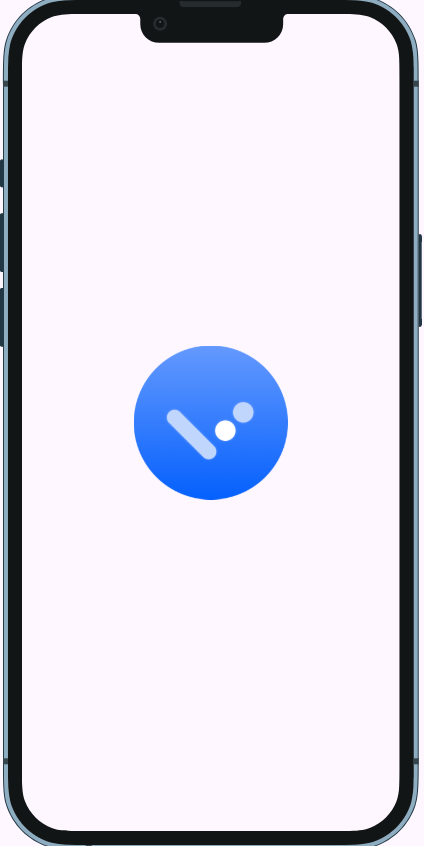
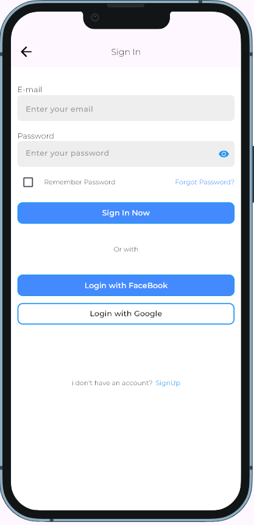
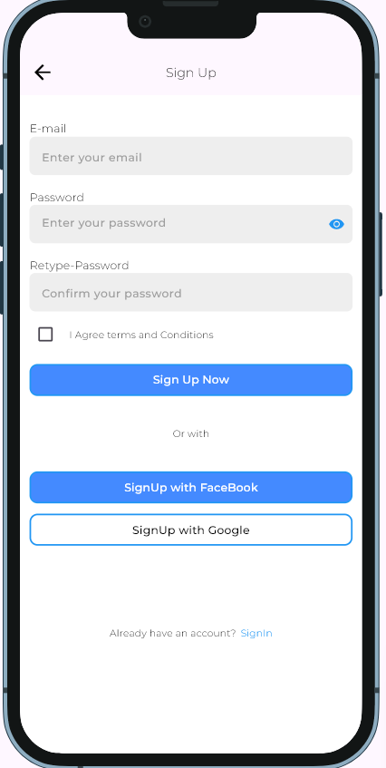
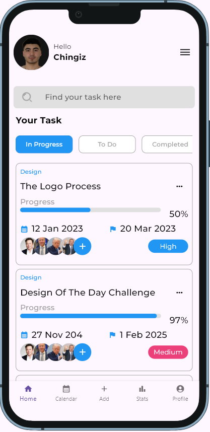

# 📋 Flutter ToDo App

A simple and elegant ToDo application built with Flutter 🚀  
Organize your day by adding, completing, and deleting tasks with ease.

---

## ✨ Features

✅ Add new tasks  
✅ Mark tasks as completed  
❌ Delete tasks  
⚡ Smooth performance with clean UI  

---
## 📱 Screenshots


## 📸 UI Preview

### 📝 Splash / Welcome Screen  


### 🔐 Sign In Screen  


### 🆕 Sign Up Screen  


### 🔐 Last Page Screen  



## 🛠️ Technologies Used

- Flutter 🐦
- Dart 💙
- Material Design
- VS Code

## 📦 Installation

```bash
git clone https://github.com/your-username/todo_app.git
cd todo_app
flutter pub get
flutter run
